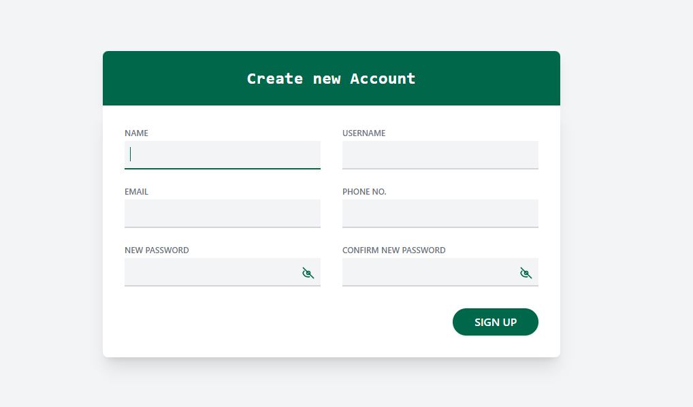
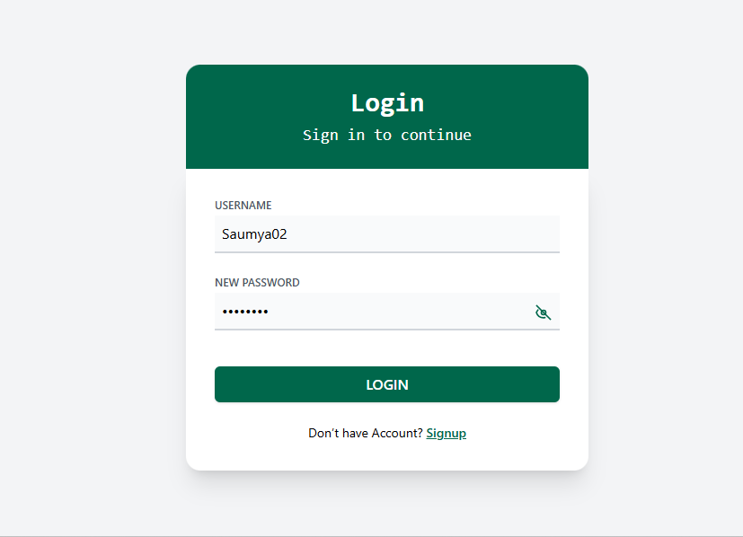
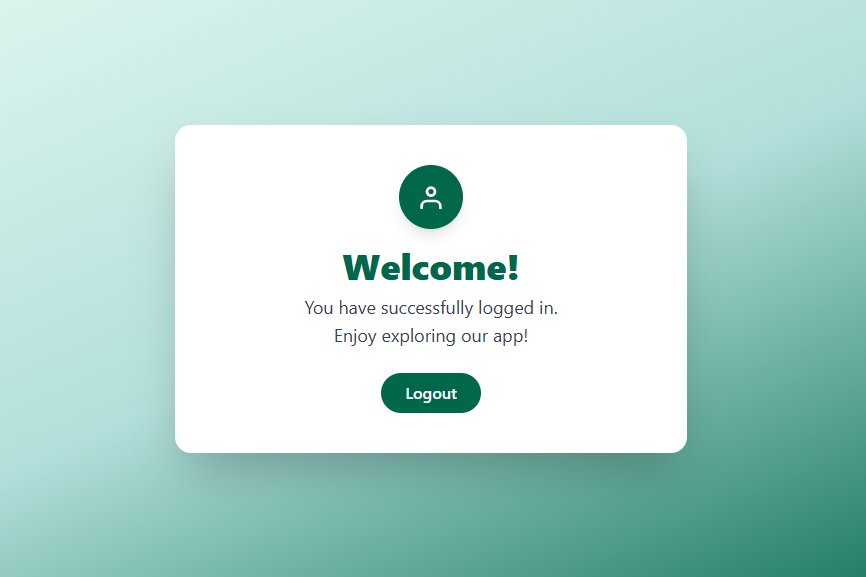
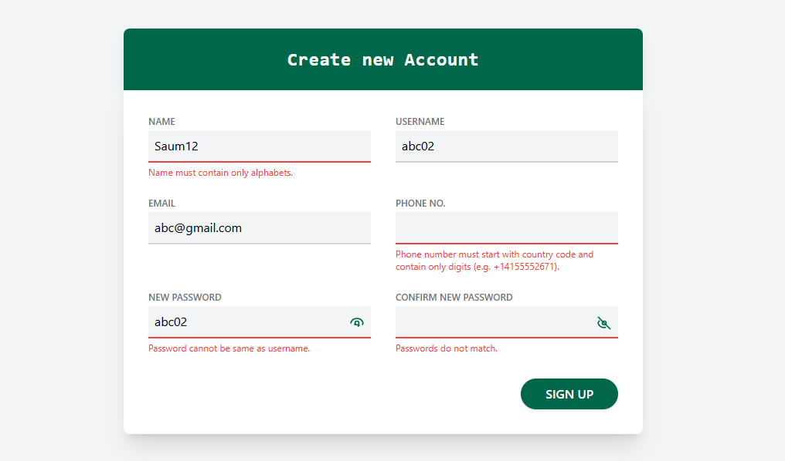

# Login & Signup React App

A modern, responsive React application for user authentication featuring login and sign-up screens.  
It includes form validation, error messages, and smooth navigation between pages.  
Built with Tailwind CSS for a clean and professional user experience.

## 🚀 Getting Started

### Prerequisites

Make sure you have the following installed on your machine:

- **Node.js** (version 18.0 or higher) - [Download here](https://nodejs.org/)
- **npm**  (comes with Node.js)
- **Git** - [Download here](https://git-scm.com/)


## How to Run Locally

1. **Clone the repository:**
   ```
   git clone https://github.com/SaumyaGautam02/Saumya-Gautam.git
   cd login-signup-app
   ```

2. **Install dependencies:**
   ```
   npm install
   ```

3. **Start the development server:**
   ```
   npm start
   ```

4. **Open your browser and go to:**
   ```
   http://localhost:3000
   ```

## Usage

- Start at the **Login** page to sign in with your credentials.
- If you don't have an account, click **Signup** to create a new account.
- All fields are validated and error messages are shown for invalid input.
- After successful signup, you will be redirected to the login page with a success message.
- After successful login, you will be redirected to the **Home** page, which displays a welcome message and a logout button.
- Click **Logout** on the Home page to return to the login screen.


## Screenshots

### Signup Page



### Login Page



### Home Page



### Validation Errors



---

## Live Demo
You can try the live demo of the application here: [Live Demo Link](https://your-demo-link.com)


Project Link: [https://github.com/SaumyaGautam02/Saumya-Gautam]